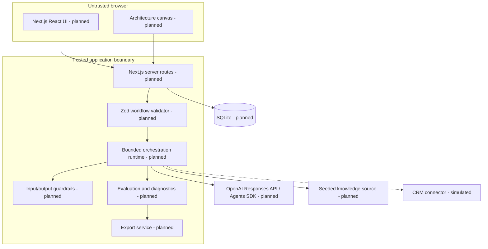

# Container Architecture

**Status:** Planned. AO-002 will establish the first runtime containers.

## Deployment shape

The MVP is a single deployable web application plus SQLite, packaged for Docker Compose. The UI and server share one codebase but maintain a hard browser/server trust boundary. Structured JSON logs exclude secrets and sensitive content. A documented PostgreSQL migration path is planned; PostgreSQL is not an MVP runtime requirement.
