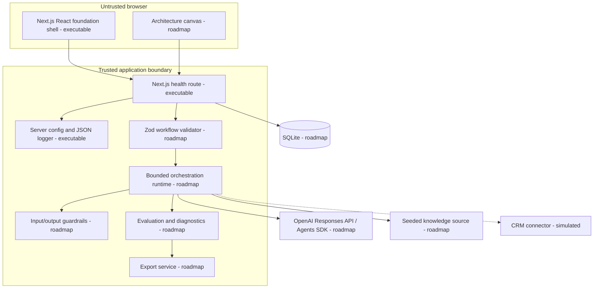

# Container Architecture

**Status:** AO-002 implements the application shell, health route, server configuration/logging boundary, and single Docker deployable. Product modules remain planned.

## Deployment shape

The implemented foundation is one standalone Next.js container packaged with Docker Compose. It runs as a non-root user with a read-only filesystem, dropped capabilities, bounded temporary cache, and health check. The UI and server share one codebase while `server-only` modules enforce the environment/logging boundary. Structured JSON logs recursively redact sensitive keys.

SQLite and its documented PostgreSQL migration path remain planned. Neither database is required for the foundation runtime.
