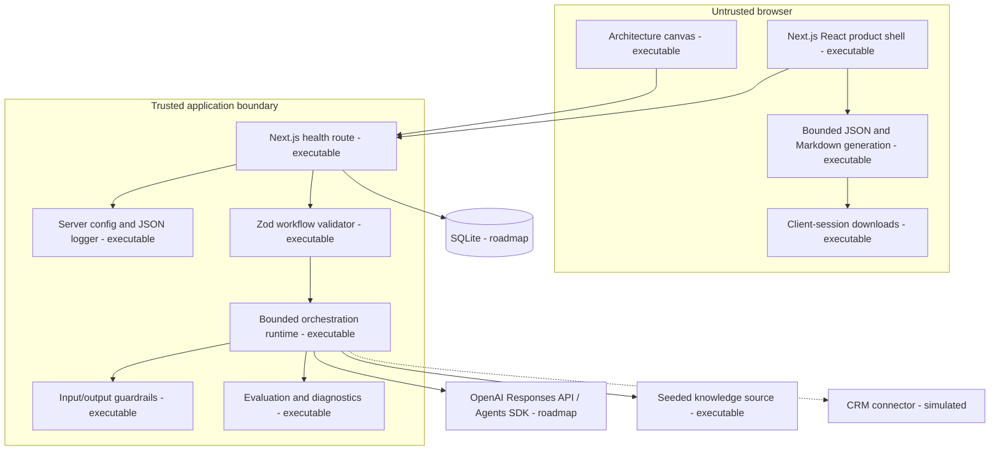

# Container Architecture

**Status:** AO-010 hardens the existing single Next.js judge-path deployable. Model calls and privileged runtime behavior remain server-side; no new deployable, provider, upload, connector, database, or persistence service is introduced.

## Deployment shape

The implemented foundation is one standalone Next.js container packaged with Docker Compose. It runs as a non-root user with a read-only filesystem, dropped capabilities, bounded temporary cache, and health check. The UI and server share one codebase while `server-only` modules enforce the environment/logging boundary. Structured JSON logs recursively redact sensitive keys.

SQLite and its documented PostgreSQL migration path remain planned. Neither database is required for the foundation runtime.

AO-009 does not add a server-side export service, route, action, database, registry, or persistence layer. The untrusted browser receives already bounded workflow and RunEvidence state, creates two validated text artifacts in memory, initiates a download, and revokes the object URL. Export generation cannot invoke the model.

## AO-010 process and network controls

The server action applies authentication, a process-local fixed-window limiter, and strict request-size checks before workflow planning or provider construction. The limiter permits six attempts per subject digest per 60 seconds, holds at most 1,024 entries, prunes expired entries, and fails closed at capacity. It resets with the process and is not a distributed rate or billing service.

The health response allowlists only status, service, version, and timestamp. Existing container controls remain non-root execution, a read-only filesystem, dropped capabilities, a bounded temporary cache, and a loopback health probe. The browser cannot select provider endpoints or credentials. The deterministic fixture binds to `127.0.0.1` on an ephemeral port and accepts only its three fixed paths with a 64 KiB body limit and one chat request.

The existing security headers remain unchanged. A nonce-aware production Content Security Policy remains a documented low residual because it requires deployment-specific Next.js and download testing.

## AO-011 portable Compose boundary

The primary Compose project has one long-running `app` service and two short-lived services behind the `tools` profile. `credential-bootstrap` uses the locked tooling image, has no network, and writes only to the `judge-credentials` volume. `judge-readiness` uses the same image, joins only the application network, mounts credentials read-only, waits for app health, and emits fixed codes. Neither service publishes a port. The tooling image contains locked development tooling, bounded scripts/source, the canonical workflow, and bundled corpus; documentation, receipts, local environment files, test/coverage/browser output, model artifacts, Git metadata, and database artifacts stay outside the build context.

The app starts only after the fixed completion marker exists, sources `app.env` without printing it, and mounts the credential volume read-only. Non-root UID/GID 1001, read-only root filesystems, dropped capabilities, `no-new-privileges`, bounded no-exec tmpfs mounts, the four-field health route, and `ai-orchestra:local` remain. No Docker socket, writable repository mount, provider service, database volume, persistent application state, reverse proxy, registry, or containerized Ollama is introduced.
