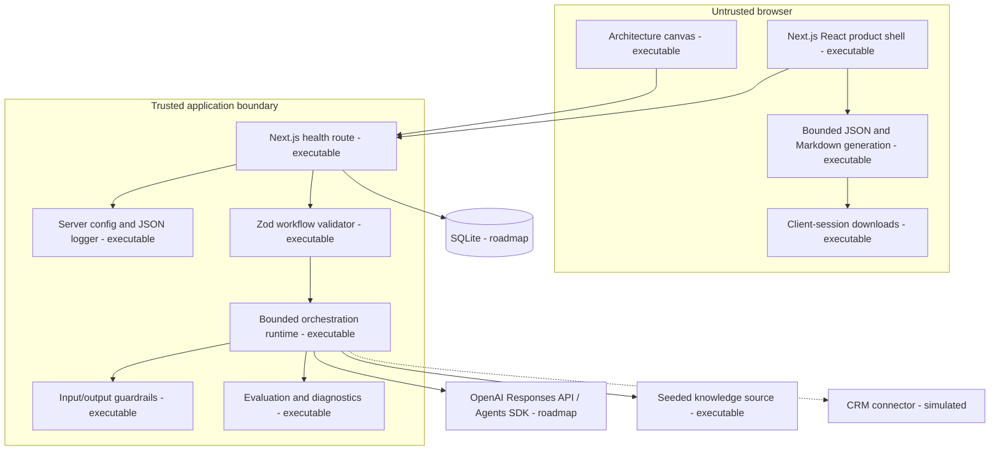

# Container Architecture

**Status:** AO-009 adds executable browser-local export generation to the existing single Next.js deployable. Model calls and privileged runtime behavior remain server-side.

## Deployment shape

The implemented foundation is one standalone Next.js container packaged with Docker Compose. It runs as a non-root user with a read-only filesystem, dropped capabilities, bounded temporary cache, and health check. The UI and server share one codebase while `server-only` modules enforce the environment/logging boundary. Structured JSON logs recursively redact sensitive keys.

SQLite and its documented PostgreSQL migration path remain planned. Neither database is required for the foundation runtime.

AO-009 does not add a server-side export service, route, action, database, registry, or persistence layer. The untrusted browser receives already bounded workflow and RunEvidence state, creates two validated text artifacts in memory, initiates a download, and revokes the object URL. Export generation cannot invoke the model.
