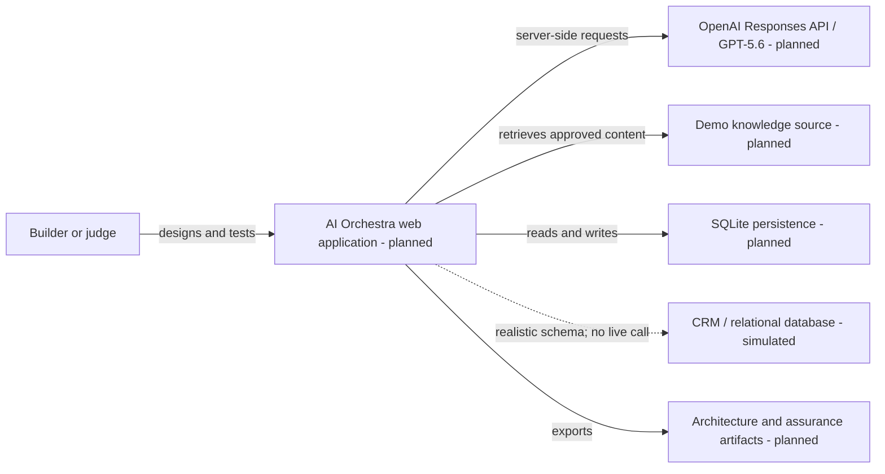

# System Context

**Status:** Planned; no application component is implemented as of July 13, 2026.

AI Orchestra lets a builder compose and run a governed AI architecture while preserving understandable validation and assurance evidence.

## Trust boundaries

Browser input is untrusted. Model requests, secrets, retrieval, tools, persistence, and policy enforcement stay server-side. Uploaded and retrieved content is data, not authority. The simulated CRM is visibly non-executable.
