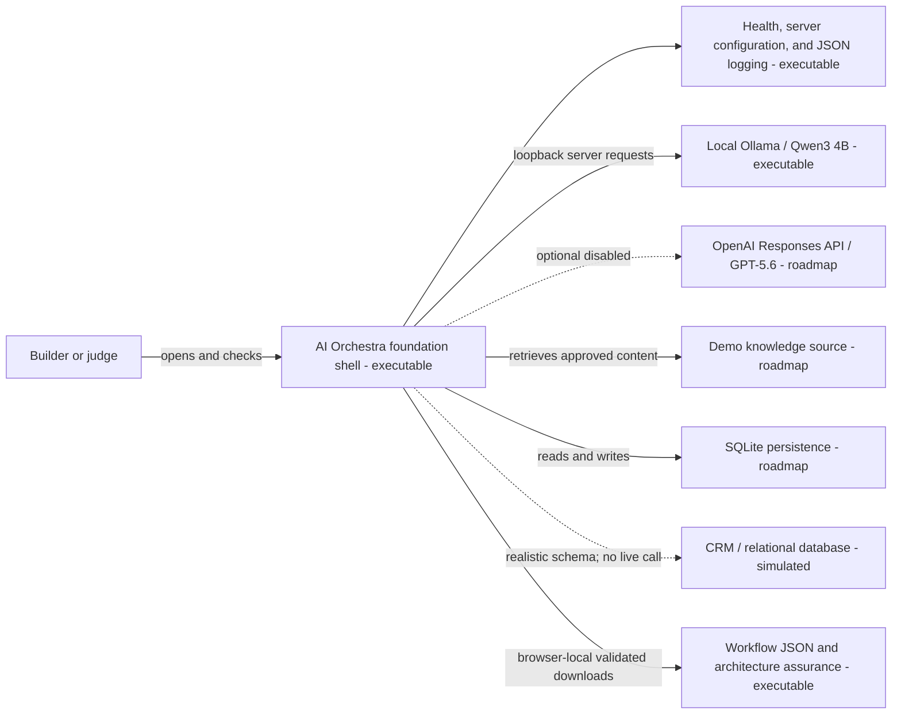

# System Context

**Status:** The governed local RAG, in-memory RunEvidence, and bounded browser-local AO-009 exports are executable. Optional hosted and persistence integrations remain deferred.

AI Orchestra lets a builder compose and run a governed AI architecture while preserving understandable validation and assurance evidence.

## Trust boundaries

Browser input is untrusted. Runtime environment access and logging are implemented in server-only modules, and no secret is exposed through a `NEXT_PUBLIC_` variable. Future model requests, retrieval, tools, persistence, and policy enforcement must stay server-side. Uploaded and retrieved content will be data, not authority. The simulated CRM remains visibly non-executable.

AO-009 artifact generation is intentionally browser-local and bounded to the current client session. It consumes validated workflow, architecture-report, and RunEvidence projections; it cannot call a provider. The generated text is not persisted or logged, and its temporary object URL is revoked after download initiation.
